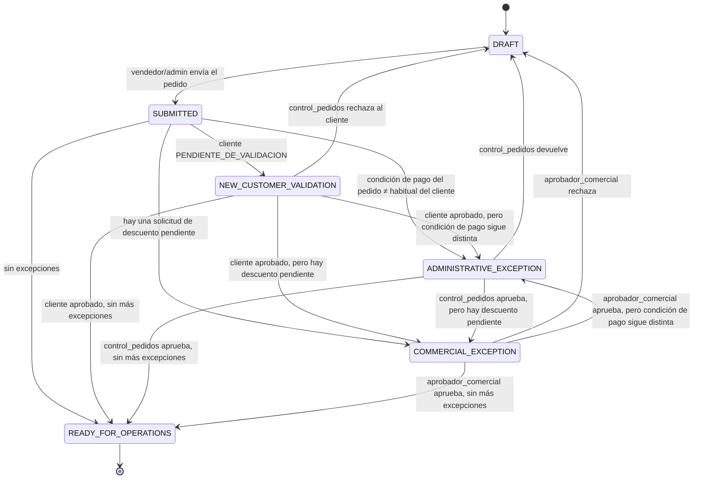

# Máquina de estados de pedidos

Este documento describe el flujo de un pedido desde que un vendedor (o un
administrador a nombre de un vendedor) lo arma hasta que queda listo para que
Operaciones lo despache. La autoridad real de estas reglas vive en
`supabase/migrations/0036_order_workflow_functions.sql` (funciones `SECURITY
DEFINER`); `domain/orders.ts` es un espejo en TypeScript para tests rápidos y
para dar feedback optimista en la UI — si alguna vez divergen, gana SQL.

## Diagrama de estados

`AUTOMATIC_VALIDATION` (el paso "bifurca" del PRD) **nunca se persiste como
fila en reposo** — es el momento, dentro de `pedidos.submit_order()` o
`pedidos.reevaluate_order()`, en que el servidor decide a cuál de los 4
estados finales corresponde el pedido. No hay que buscarlo en la base de
datos: si un pedido está `SUBMITTED`, es solo por la duración de una
transacción SQL, nunca algo que la UI llegue a mostrar.

## Tabla transición → rol → condición → efecto

| Transición | Quién la dispara | Condición | Queda en |
|---|---|---|---|
| `DRAFT → SUBMITTED` | vendedor dueño o admin | el pedido tiene al menos 1 línea | `order_status_history` |
| `SUBMITTED → NEW_CUSTOMER_VALIDATION` | automático (`submit_order`) | `customers.estado = PENDIENTE_DE_VALIDACION` | `order_status_history` |
| `SUBMITTED → ADMINISTRATIVE_EXCEPTION` | automático (`submit_order`) | `orders.payment_terms_id ≠ customers.condicion_pago_habitual_id` | `order_status_history` |
| `SUBMITTED → COMMERCIAL_EXCEPTION` | automático (`submit_order`) | existe `approval_requests` con `estado = PENDIENTE` para alguna línea | `order_status_history` |
| `SUBMITTED → READY_FOR_OPERATIONS` | automático (`submit_order`) | ninguna de las anteriores | `order_status_history` |
| `NEW_CUSTOMER_VALIDATION → DRAFT` | control_pedidos/admin | cliente rechazado | `order_status_history`, `customers.estado` |
| `NEW_CUSTOMER_VALIDATION → *` | control_pedidos/admin (vía `reevaluate_order`) | cliente aprobado | `order_status_history`, `customers.estado` |
| `ADMINISTRATIVE_EXCEPTION → DRAFT` | control_pedidos/admin | "devolver" | `order_status_history`, motivo |
| `ADMINISTRATIVE_EXCEPTION → ADMINISTRATIVE_EXCEPTION` | control_pedidos/admin | "observar" (no cambia estado) | `order_observations` |
| `ADMINISTRATIVE_EXCEPTION → *` | control_pedidos/admin (vía `reevaluate_order`) | "aprobar" | `order_status_history` |
| `COMMERCIAL_EXCEPTION → DRAFT` | aprobador_comercial/admin | `RECHAZAR` | `order_status_history`, `approval_decisions` |
| `COMMERCIAL_EXCEPTION → *` | aprobador_comercial/admin (vía `reevaluate_order`) | `APROBAR` / `APROBAR_OTRO_PRECIO` | `order_status_history`, `approval_decisions` |
| (sin cambio) | aprobador_comercial/admin | `SOLICITAR_INFO` | `order_observations` |

## Por qué no hay un atajo directo excepción → READY_FOR_OPERATIONS

Cuando se resuelve una excepción (cliente validado, excepción administrativa
aprobada, descuento aprobado), el pedido **vuelve a pasar por la misma lógica
de bifurcación**, no salta directo a `READY_FOR_OPERATIONS`. Esto maneja casos
compuestos sin duplicar lógica: por ejemplo, si un `aprobador_comercial`
aprueba un descuento pero la condición de pago del pedido sigue siendo
distinta de la habitual del cliente, el pedido cae en
`ADMINISTRATIVE_EXCEPTION` en vez de saltarse esa validación.

## Recálculo de precios: una sola vez

`pedidos.submit_order()` recalcula el precio de cada línea (contra
`price_list_items`/`product_tax_profiles` vigentes) **solo en la transición
`DRAFT → SUBMITTED`**. La reevaluación posterior (`pedidos.reevaluate_order()`)
nunca vuelve a tocar precios — si lo hiciera, sobrescribiría un precio que un
`aprobador_comercial` acaba de aprobar manualmente vía `APROBAR_OTRO_PRECIO`.

## TODOs explícitos para fases posteriores

Ninguno de estos puntos está implementado en Fase 4 — quedan anclados al
punto exacto donde deberían engancharse:

- **Stock**: `READY_FOR_OPERATIONS` debería, antes de pasar a despacho,
  verificar/reservar stock. Hoy no existe ninguna tabla de stock; un pedido
  `READY_FOR_OPERATIONS` no implica que haya inventario disponible. Ver el
  supuesto ya anotado en `docs/business-rules.md` ("pendiente de asignación de
  stock" entre aprobación comercial y despacho).
- **Promociones/bonificaciones**: `order_items`/`calculateLineItem` no
  contemplan escalas de precio ni bonificaciones — `products.codigo_bonificacion`
  ya se guarda desde Fase 2 para no perder el dato mientras tanto.
- **GRE (guía de remisión electrónica)**: no hay ningún gancho para generarla;
  llegaría después de `READY_FOR_OPERATIONS`, cuando Operaciones confirme
  despacho.
- **Factura/boleta**: `customers.tipo_comprobante_permitido` ya existe pero no
  se usa todavía para emitir nada — la integración con NubeFact es de una fase
  posterior.
- **Despacho real**: no hay pantalla ni tabla para Operaciones más allá de que
  la policy `orders_select`/`order_items_select` ya deja preparada la lectura
  de pedidos `READY_FOR_OPERATIONS` para cuando exista esa pantalla.
